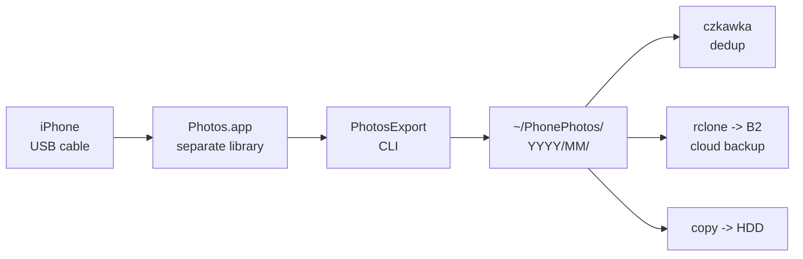

# PhotosExport — Real-life Guide: iPhone → Local Mac Folder

> A practical, step-by-step guide to exporting an iPhone's photos to a clean `YYYY/MM` folder tree on your Mac — built from a real export session (~40 GB iPhone → local folder), including the questions, gotchas, and fixes that came up along the way.
>
> **Format note:** Portable Markdown (renders on GitHub). In an **OpenKnowledge** project, the callouts/accordions here map to OK components: `> [!NOTE]` → `<Callout type="note">`, `<details>` → `<Accordion>`, and grouped sections → `<Tabs>`. Mermaid fences and code blocks render natively in both.

---

## TL;DR — the pipeline



**Photos.app is just a temporary middleman (staging).** The folder copy is the one you keep.

```
 iPhone ──USB──▶ Photos.app library ──PhotosExport──▶ ~/PhonePhotos/
 (source)       (STAGING — disposable)              (the real copy you keep)
                                                    YYYY/MM/*.jpg + .mp4 + .json
```

| You give it | You get out |
|---|---|
| An iPhone + a USB cable + ~1.5× free disk | `~/PhonePhotos/YYYY/MM/` with originals, Live Photo videos, edits, and `.json` metadata sidecars |

---

## Prerequisites

> [!NOTE]
> - **macOS 13+** (PhotosExport uses the Photos framework)
> - **Swift** — Xcode Command Line Tools (`xcode-select --install` if missing)
> - **Photos.app** (built in)
> - **USB cable** (cable import, no cloud required)
> - **Free disk** ≈ 1.5× the library size (staging copy + export)

---

## Step 0 — Decide: one library, or a separate one?

If you're exporting **someone else's** phone (e.g. a partner's), import into a **separate Photos library** so their photos never mix with yours. PhotosExport reads the *entire* (system) library filtered by year — it can't filter by person or source device.

| Situation | Recommended |
|---|---|
| Exporting your own phone | Your existing library is fine |
| Exporting someone else's phone | **Create a separate library** (Step 1) |

---

## Step 1 — Create a separate Photos library (optional but recommended)

<details>
<summary><b>How to create a new library + make it the System Photo Library</b></summary>

You create the library **from inside Photos**, not from the Applications folder.

1. **Quit Photos** (`⌘Q`).
2. **Hold ⌥ (Option) and click Photos** in the Dock. Keep holding until a dialog appears: *"Choose the library you want Photos to open."*
3. Click **"Create New…"** → choose a location (e.g. `~/Pictures`) → name it e.g. `Natalia Photos` → **Save**. (Creates `Natalia Photos.photoslibrary`.)
4. Photos opens the empty library.
5. **Photos → Settings (`⌘,`) → General → "Use as System Photo Library."** ← this is what lets PhotosExport read *this* library.

> [!IMPORTANT]
> PhotosExport reads the **System Photo Library**. The button tells you the state:
> - **"Use as System Photo Library"** (clickable) → it's NOT set yet. Click it.
> - **"Photos is using the system photo library"** (greyed) → it IS set. Good.
>
> Only one library can be "system" at a time. Switch back later: Option-open Photos → choose your original library → set it as System Photo Library again.

**To switch back when done:** Quit Photos → hold ⌥ → open Photos → choose your original library → Settings → General → "Use as System Photo Library."

</details>

---

## Step 2 — Import the iPhone into the library

<details>
<summary><b>Cable import steps + the stuck-progress-bar fix</b></summary>

1. Plug the iPhone into the Mac via USB.
2. On the phone, tap **Trust** and enter the passcode if asked.
3. In Photos, find the iPhone in the **left sidebar** under **Devices** → click it.
4. Make sure **"Delete items after importing" is UNCHECKED** (keep the phone intact until the whole backup is verified).
5. Click **"Import All New Photos"** (or select a few → "Import Selected" for a test).
6. Wait for the progress bar to finish. Keep Photos open and the phone plugged in.

> [!TIP]
> **Small-batch E2E first.** Before importing all ~40 GB, import ~6 photos and run the full export pipeline (Steps 3–7) on them. Confirms everything works before the long import. This guide was written from exactly such a test.

> [!WARNING]
> **Stuck progress bar?** If the bar freezes and nothing appears under **Utilities → Imports**:
> 1. Click **"Stop Import"**.
> 2. **Unplug the iPhone**, plug it back in, re-tap **Trust**.
> 3. Retry with just 1 photo. If that imports fast, the earlier stall was a hiccup.
>
> A common cause: **iCloud Photos "Optimize iPhone Storage"** is on for the phone, so it's fetching originals from iCloud before transferring. Check *Settings → [your name] → iCloud → Photos* on the phone.

**Where did my imported photos go?** They appear under **Utilities → Imports** in the Photos sidebar (a group dated today). You don't need to organize them — PhotosExport builds the `YYYY/MM` folders.

</details>

---

## Step 3 — Build PhotosExport

<details>
<summary><b>Clone + compile (with the Swift 6.2 → 6.1 fix)</b></summary>

```bash
# 1) Check Swift is installed
swift --version
#   If "command not found": xcode-select --install, then re-run.

# 2) Clone the project
cd ~/repos
git clone --depth 1 https://github.com/rcarmo/PhotosExport
cd PhotosExport

# 3) Build
swift build -c release
```

The compiled binary ends up at `.build/release/PhotosExport`.

> [!CAUTION]
> **Build error on Swift 6.1:**
> ```
> error: package 'photosexport' is using Swift tools version 6.2.0 but the installed version is 6.1.0
> ```
> The package declares `swift-tools-version: 6.2`. Fix it in two edits to `Package.swift`:
>
> 1. Change line 1: `// swift-tools-version: 6.2` → `// swift-tools-version: 6.1`
> 2. In `swiftSettings`, change `.unsafeFlags(["-parse-as-library"])` to:
>    `.unsafeFlags(["-parse-as-library", "-swift-version", "5"])`
>
> The `-swift-version 5` disables Swift 6 strict-concurrency (Sendable) errors that 6.1 enforces on this Photos-framework code.
>
> ```bash
> sed -i '' 's|// swift-tools-version: 6.2|// swift-tools-version: 6.1|' Package.swift
> sed -i '' 's|"-parse-as-library"\]|"-parse-as-library", "-swift-version", "5"]|' Package.swift
> swift build -c release
> ```
>
> (These are local patches; re-apply after a `git pull`.)

</details>

---

## Step 4 — Grant Photos permission

<details>
<summary><b>Why you must run from your own Terminal</b></summary>

macOS ties **Photos-library permission to the launching app**. PhotosExport must be run from **Terminal.app** (not an agent shell), so the permission attaches to Terminal.

```bash
cd ~/repos/PhotosExport
./.build/release/PhotosExport --help
```

If it exits with **"Photos access denied"**:
> **System Settings → Privacy & Security → Photos → enable Terminal**, then re-run.

The first successful run prints progress to the terminal (creating folders, enumerating assets, writing files).

</details>

---

## Step 5 — Create the export folder (PhotosExport won't)

```bash
mkdir -p ~/PhonePhotos-test   # PhotosExport requires the dir to already exist
```

> [!IMPORTANT]
> Without this you'll get:
> `Invalid arguments: exportDirectoryDoesNotExist("/Users/.../PhonePhotos-test")`

---

## Step 6 — Run the export

```bash
cd ~/repos/PhotosExport
./.build/release/PhotosExport \
  --export-directory ~/PhonePhotos-test \
  --metadata \
  --year 2000 --end-year 2026 \
  --incremental
```

| Flag | What it does |
|---|---|
| `--export-directory PATH` | Where to write. **Must already exist.** |
| `--metadata` | Also write a `.json` sidecar per asset (EXIF/GPS/IPTC/XMP + place names). |
| `--year YYYY` | **Filter** — only export assets from that calendar year. Default: current year. |
| `--end-year YYYY` | Pair with `--year` to export a range (inclusive). |
| `--incremental` | Skip files whose destination name already exists (safe to re-run). |
| `--log-file PATH` | Write the progress log to a file instead of stderr. |
| `--debug` | Verbose output. |

> [!NOTE]
> **`--year` is a *filter*, not organization.** The `YYYY/MM` folders and the `YYYYMMDDHHMMSS.ext` filenames are **always automatic**, based on each photo's creation date. You only set `--year`/`--end-year` to limit *which* photos get exported. Use a wide range (`--year 2000 --end-year 2026`) to grab everything.

**Output layout:**
```
~/PhonePhotos-test/
├── 2024/
│   └── 12/
│       ├── 20241220114619.jpg      # the photo
│       ├── 20241220114619.json     # its metadata sidecar (--metadata)
│       ├── 20241220111013.mp4      # Live Photo paired video
│       └── 20241220125459.plist     # adjustment / edit data
└── 2025/
    └── 01/
        └── ...
```

</details>

---

## Step 7 — Verify the output

```bash
# Media files only (hide .json sidecars + .DS_Store):
tree -I '*.json|.DS_Store' ~/PhonePhotos-test
```

`tree -I 'PATTERN'` ignores files matching the pattern (`|` = "or"). Expect to see `.jpg`, `.mp4`, `.mov` (Live Photo pairs), and `.plist` (edits) — that's the completeness Image Capture would drop.

```bash
# Counts:
find ~/PhonePhotos-test -type f ! -name '*.json' ! -name '.DS_Store' | wc -l  # media files
find ~/PhonePhotos-test -name '*.json' | wc -l                              # sidecars
```

---

## Step 8 — Cleanup: free Mac disk space (Photos.app is staging)

<details>
<summary><b>Where to delete — and the two-step purge</b></summary>

After the export is verified, you have the photos in **two** places: the Photos library (staging) and the exported folder (the keeper). You only need the folder.

**Delete from the *library* view — NOT the device view:**

| View | Acts on | Use it to… |
|---|---|---|
| **Utilities → Imports** | the Mac's Photos library | ✅ free **Mac** disk space |
| **Devices → iPhone** | the iPhone's storage | ❌ leave alone for now (frees *phone* space) |

So: **Imports** (select the imported group → `⌘Delete`), **not** the iPhone device view.

**Two steps to actually reclaim the space** (Photos keeps deleted items ~30 days recoverable):

1. **Imports** → select the photos → `⌘Delete`. They move to **Recently Deleted**.
2. Sidebar → **Recently Deleted** → **"Delete All"** → enter password → permanently gone → **disk space freed now**.

> [!WARNING]
> **Safety order before freeing the *iPhone*:**
> 1. Verify the export folder.
> 2. Copy to external HDD + sync to cloud (e.g. B2 via rclone).
> 3. **Then** delete from the iPhone (on the device, or Image Capture's "delete after importing").
>
> Deleting from Photos.app does **not** free iPhone space — and the exported folder copies are independent files on disk, so deleting from Photos.app leaves them untouched.

</details>

---

## FAQ — questions that came up in the session

<details>
<summary><b>Do I need iCloud / cloud sync to use PhotosExport?</b></summary>

**No.** "Photos library on the Mac" ≠ iCloud. You can import from the iPhone to a Mac Photos library over **USB only** (keep iCloud Photos off). Nothing syncs to the cloud. iCloud Photos is just one *optional* way photos enter the library.
</details>

<details>
<summary><b>Can I test with a small batch first?</b></summary>

**Yes — recommended.** Import ~6 photos, run the full export to a `*-test` folder, verify the `YYYY/MM` structure + sidecars, then do the real import. This caught several issues in the real session (Swift version, missing dir, permission) before committing to ~40 GB.
</details>

<details>
<summary><b>How do I keep two people's photos separate (mine + someone else's)?</b></summary>

PhotosExport can't filter by person/source — it exports by calendar year across the whole system library. Use a **separate Photos library** for the other person (Step 1), set it as System Photo Library, import their phone there, export. Their `*.photoslibrary` is disposable after export — your own library is never touched.
</details>

<details>
<summary><b>After exporting, the same photos are in Photos.app AND the folder — do I need both?</b></summary>

**No.** Photos.app is just staging so PhotosExport has something to read. Once the export is verified, delete from Photos.app (Imports → Recently Deleted) to reclaim Mac disk space. The folder copies are independent and remain.
</details>

<details>
<summary><b>Where exactly do I delete to free Mac space — Imports or the iPhone device view?</b></summary>

**Imports** (the library view). Deleting there frees Mac disk space. The **Devices → iPhone** view acts on the *phone* — leave it alone until the full backup (HDD + cloud) is verified.
</details>

<details>
<summary><b>How do I remove duplicates?</b></summary>

Run **czkawka** on the exported folder. It finds exact duplicates (by content hash) and similar images; review and delete. Catches shared photos between people too.
</details>

<details>
<summary><b>Where do I see "Create New" for a library — the Applications folder?</b></summary>

No — it's inside the **Photos app**. Quit Photos, then **hold ⌥ (Option) and click Photos** to open it. A library-chooser dialog appears with a **"Create New…"** button.
</details>

<details>
<summary><b>Does the tool auto-organize folders, or do I specify --year?</b></summary>

Auto. `YYYY/MM` folders and `YYYYMMDDHHMMSS.ext` names are **always automatic** (from each photo's creation date). `--year`/`--end-year` only filter *which* years to export — they don't affect naming.
</details>

<details>
<summary><b>PhotosExport says "exportDirectoryDoesNotExist"</b></summary>

It won't create the folder for you. Run `mkdir -p ~/PhonePhotos` first.
</details>

<details>
<summary><b>Build fails with "swift tools version 6.2.0 but installed 6.1.0"</b></summary>

Patch `Package.swift` (Step 3): set tools-version to `6.1` and add `-swift-version 5` to `swiftSettings`, then rebuild.
</details>

---

## Command cheatsheet

```bash
# --- one-time setup ---
cd ~/repos
git clone --depth 1 https://github.com/rcarmo/PhotosExport
cd PhotosExport
# Patch for Swift 6.1 (if needed):
sed -i '' 's|// swift-tools-version: 6.2|// swift-tools-version: 6.1|' Package.swift
sed -i '' 's|"-parse-as-library"\]|"-parse-as-library", "-swift-version", "5"]|' Package.swift
swift build -c release

# --- per export ---
mkdir -p ~/PhonePhotos                                  # must exist first
./.build/release/PhotosExport \
  --export-directory ~/PhonePhotos \
  --metadata --year 2000 --end-year 2026 --incremental

# --- verify ---
tree -I '*.json|.DS_Store' ~/PhonePhotos
```

---

## Notes & gotchas

> [!NOTE]
> - PhotosExport reads the **System Photo Library** — switch it (Photos → Settings → General) before exporting from a non-default library.
> - `--incremental` skips files whose destination name already exists — safe to re-run; it won't re-write.
> - **Live Photos** export as `.jpg` + `.mp4`/`.mov` pairs; **edits** export as `.plist` adjustment data — the completeness Image Capture drops.
> - `--metadata` sidecars can include precise GPS + place names + camera serials — treat the output folder as sensitive.
> - `isNetworkAccessAllowed` is on: iCloud-only originals may download during export (slower, uses network).

---

*Sources: PhotosExport README (https://github.com/rcarmo/PhotosExport) + a live export session (iPhone → local folder, 2026-07-11).*