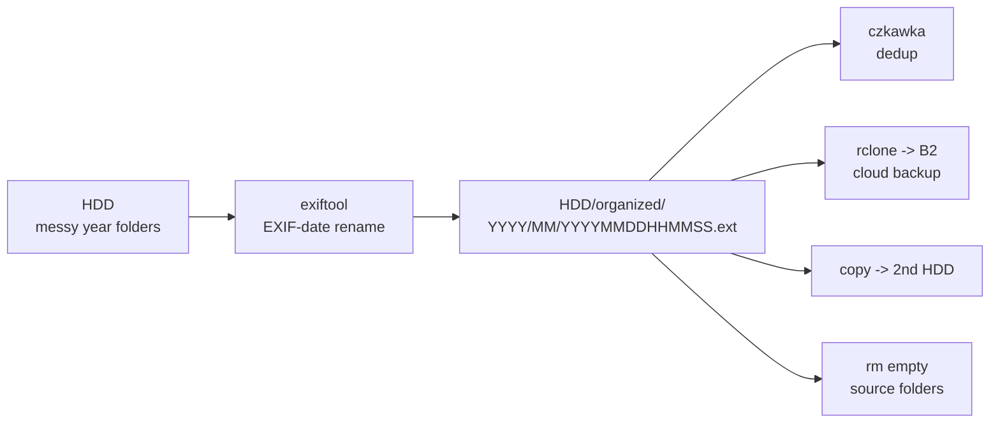

# exiftool — Real-life Guide: Organize an External HDD's Photos into `YYYY/MM/`

> A practical, step-by-step guide to taking photos already sitting in messy year folders on an external drive and re-organizing them into the same `YYYY/MM/YYYYMMDDHHMMSS.ext` tree that **PhotosExport** produces — built from a real organizing session (~36,000 files / ~256 GB across many year folders), including the questions, gotchas, and fixes that came up along the way.
>
> **When to use this vs PhotosExport:** PhotosExport only reads the Apple **Photos library**. For photos already on disk (an external HDD, old imports, scanned archives), `exiftool` does the same rename-and-file job directly on the files, in place, in one command.
>
> **Format note:** Portable Markdown (renders on GitHub). In an **OpenKnowledge** project, the callouts/accordions here map to OK components: `> [!NOTE]` → `<Callout type="note">`, `<details>` → `<Accordion>`, and grouped sections → `<Tabs>`. Mermaid fences and code blocks render natively in both.

---

## TL;DR — the pipeline



**exiftool reads each file's own EXIF dates and moves it into a date-ordered tree.** The source folder is left empty of photos; the organized folder is the one you keep.

```
 HDD/2024/ (messy) ──exiftool──▶ HDD/organized-photos/ (the keeper)
 (source)                        YYYY/MM/YYYYMMDDHHMMSS[-c].ext
```

```
# the one command (details in Step 3):
exiftool -r -v3 -P -api QuickTimeUTC=1 \
  -d '<TARGET>/%Y/%m/%Y%m%d%H%M%S%%-c.%%e' \
  '-FileName<FileModifyDate' '-FileName<CreateDate' '-FileName<DateTimeOriginal' \
  '<SOURCE>'
```

---

## Step 0 — Is this the right tool?

<details>
<summary><b>PhotosExport vs exiftool — when to use which</b></summary>

| | **PhotosExport** | **exiftool** |
|---|---|---|
| Reads from | Apple **Photos library** (System Photo Library) | **any folder on disk** |
| Direction | library → folder | folder → folder |
| Use when | exporting off a phone (via Photos.app staging) | re-organizing files already on a drive |

**PhotosExport can't organize files already on an HDD** — it has no `--input-folder` mode; it only enumerates `PHAsset`s from the Photos framework. The only PhotosExport-based workaround (import HDD photos into a library → set as System Photo Library → export) is **not recommended**: it re-stages everything into the `.photoslibrary` bundle (~1.5× disk), is slow, and you'd pay the full staging cost just for a rename.

For existing files, the tool you want is an **EXIF-date-based renamer that works in place**. `exiftool` is free, battle-tested, reads EXIF/QuickTime dates, and renames **and** moves into `YYYY/MM` in one command.

</details>

---

## Step 1 — Install exiftool

```bash
brew install exiftool
exiftool -ver          # confirm: e.g. 13.55
```

> [!NOTE]
> exiftool is a Perl script + binary. Homebrew handles both. No compilation, no Xcode needed.

---

## Step 2 — Small-batch test first (avoid two real bugs)

<details>
<summary><b>Copy ~10 files with <code>cp -p</code>, organize the copy, eyeball the result</b></summary>

**Always test on a copy.** exiftool has no true dry-run, and a test on a copy leaves originals untouched.

```bash
# 1) make a tiny sample (pick ~10 varied files: JPG, HEIC+MOV Live Photo pair, a PNG)
mkdir -p ~/Downloads/exiftool-sample
cp -p '/Volumes/HDD/2024/IMG_0001.jpg' ~/Downloads/exiftool-sample/   # -p = preserve mtimes!
cp -p '/Volumes/HDD/2024/IMG_0002.HEIC' ~/Downloads/exiftool-sample/
# ...a few more

# 2) organize the sample into a sibling output folder
mkdir -p ~/Downloads/exiftool-out
exiftool -r -v -P -api QuickTimeUTC=1 \
  -d '~/Downloads/exiftool-out/%Y/%m/%Y%m%d%H%M%S%%-c.%%e' \
  '-FileName<FileModifyDate' '-FileName<CreateDate' '-FileName<DateTimeOriginal' \
  ~/Downloads/exiftool-sample
```

Then inspect: do the new names match each file's real EXIF date?

```bash
# check a file's real date tags:
exiftool -s -DateTimeOriginal -CreateDate -FileModifyDate ~/Downloads/exiftool-sample/IMG_0001.jpg
# see the output tree:
find ~/Downloads/exiftool-out -type f | sort
```

> [!CAUTION]
> **Two bugs the small-batch test caught in the real session — both silent:**
>
> **1. Fallback order was backwards.** exiftool applies multiple `-FileName<…` assignments **in order, and the last one defined wins**. Putting `FileModifyDate` last made it *always* override the real capture date → every file got named from its mtime. **Fix: put the most-preferred date LAST:**
>
> ```
> '-FileName<FileModifyDate'   # tried first
> '-FileName<CreateDate'        # overrides if present
> '-FileName<DateTimeOriginal' # overrides again = MOST preferred wins
> ```
>
> **2. `cp` reset mtimes to "now".** For EXIF-stripped files (e.g. WhatsApp media with **only** `FileModifyDate` as a usable date), a plain `cp` wipes the mtime to today — so even a correct fallback chain names them with today's date. **Fix: `cp -p` preserves mtimes.** (For the real run on the HDD directly, mtimes are intact — no `cp` involved — so this only matters when staging a test copy.)
>
> Test result after the fix: EXIF dates (`DateTimeOriginal 2023:04:08 12:49:13` → `20230408124913.JPG`), fallback to mtime for stripped files, and **Live Photo pairs stay together** (`20220108103132.MOV` + `20220108103133.HEIC`).

</details>

---

## Step 3 — Run the organize

<details>
<summary><b>The real command — flags explained</b></summary>

Put the target as a **sibling folder on the same volume** as the source. That makes the move a **rename** (instant, byte-safe, no extra disk, no bytes rewritten).

```bash
exiftool -r -v3 -P -api QuickTimeUTC=1 \
  -d '/Volumes/HDD/organized-photos/%Y/%m/%Y%m%d%H%M%S%%-c.%%e' \
  '-FileName<FileModifyDate' \
  '-FileName<CreateDate' \
  '-FileName<DateTimeOriginal' \
  '/Volumes/HDD/2024'
```

| Flag | What it does |
|---|---|
| `-r` | Recurse into all subfolders of the source. |
| `-v3` | Very verbose: prints each file's `old --> new` path (the audit trail). |
| `-P` | Preserve the file's `FileModifyDate` across the rename (don't set it to now). |
| `-api QuickTimeUTC=1` | Treat QuickTime/video `CreateDate` as UTC (corrects timezone offset on videos). |
| `-d '…'` | Date format **template** — `%Y/%m/` literally creates the `YYYY/MM/` folders; `%Y%m%d%H%M%S` is the filename timestamp; `%%-c` appends a collision suffix (`-1`, `-2`…); `%%e` keeps the original extension. |
| `-FileName<…` | "Set the filename **from** this date tag." Multiple = fallback chain, **last-defined wins.** |

**Fallback chain (most-preferred LAST):**

```
'-FileName<FileModifyDate'    # 3rd choice: filesystem mtime (always exists)
'-FileName<CreateDate'         # 2nd choice: video/EXIF create date
'-FileName<DateTimeOriginal'  # 1st choice: the real capture date
```

Order matters: a file with `DateTimeOriginal` gets named from it; a video with only `CreateDate` falls back to that; a stripped file with neither falls back to `FileModifyDate`. If `FileModifyDate` is also missing/zero, the file lands in `1970/` (epoch zero) — see FAQ.

**This moves files** out of the source into the target. If you'd rather keep the source untouched until verified, say so and use a copy-first variant (slower, doubles disk briefly).

</details>

---

## Step 4 — Verify the output (reconcile)

<details>
<summary><b>Counts, tree, and the "0 real media left in source" check</b></summary>

```bash
# media files now in target:
find /Volumes/HDD/organized-photos -type f ! -name '._*' ! -name '.DS_Store' \
  \( -iname '*.jpg' -o -iname '*.jpeg' -o -iname '*.heic' \
     -o -iname '*.mov' -o -iname '*.mp4' -o -iname '*.png' \) | wc -l

# real media left in source (expect 0 — nothing lost):
find /Volumes/HDD/2024 -type f ! -name '._*' ! -name '.DS_Store' \
  \( -iname '*.jpg' -o -iname '*.jpeg' -o -iname '*.heic' \
     -o -iname '*.mov' -o -iname '*.mp4' -o -iname '*.png' \) | wc -l

# eyeball the structure:
tree -I '*.json|.DS_Store' /Volumes/HDD/organized-photos | head -40
```

**Reconciliation = the safety check.** `target_count == previous_target + source_moved`, and `0` real media left in source. The "X files weren't updated due to errors" line from exiftool is **expected and fine** — those are the junk files (below), not photos.

**Spot-check names against EXIF** for a few files:

```bash
exiftool -s -DateTimeOriginal /Volumes/HDD/organized-photos/2023/04/20230408124913.jpg
# should print 2023:04:08 12:49:13 — matching the filename
```

</details>

---

## Step 5 — Cleanup: junk + `.AAE` sidecars

<details>
<summary><b>The four kinds of non-photo files, and what to do with each</b></summary>

After a run, the target and source each have leftover non-photo files. Clean them:

| File type | What it is | Action |
|---|---|---|
| `._*` (AppleDouble) | macOS metadata sidecar from exFAT drives — **junk** | `find <dir> -name '._*' -delete` |
| `.DS_Store` | macOS folder metadata — **junk** | `find <dir> -name '.DS_Store' -delete` |
| `.AAE` | Apple Photos **edit-instruction** sidecar (the recipe for an edited photo) | **discard** — the original is already exported; the edit recipe is useless without Photos |
| `Thumbs.db` | Windows thumbnail cache — **junk** | `find <dir> -iname 'Thumbs.db' -delete` |

```bash
# clean junk that landed in the target:
find /Volumes/HDD/organized-photos -type f -name '._*' -delete
find /Volumes/HDD/organized-photos -type f -name '.DS_Store' -delete

# discard .AAE edit sidecars from the source:
find /Volumes/HDD/2024 -type f -iname '*.aae' ! -name '._*' -delete

# sweep remaining junk from the source:
find /Volumes/HDD/2024 -type f -name '._*' -delete
find /Volumes/HDD/2024 -type f -name '.DS_Store' -delete
```

> [!WARNING]
> **`.AAE` files are not photos.** They're the edit-instruction list from Apple Photos (which crop/filter was applied). Once the original photo is exported as a file, the `.AAE` is useless — there's no Photos library to apply it. The real session discarded them. If you want to preserve edit *recipes* for some reason, keep them — but they won't render.

> [!NOTE]
> **AppleDouble `._*.AAE` phantoms:** on exFAT drives, `find -iname '*.aae'` may also match `._IMG_1234.AAE` (the AppleDouble of an `.AAE`). These sometimes fail to unlink with "No such file" because exiftool already moved them to the target and they were cleaned there. Harmless — the **real** `.AAE` count is what matters (verify with `! -name '._*'`).

</details>

---

## Step 6 — Keep a log + a cumulative summary

<details>
<summary><b>organize.log (append per batch) + organize-summary.txt (cumulative rollup)</b></summary>

Three artifacts, two strategies:

| File | Strategy | Why |
|---|---|---|
| `organize.log` | **append** per batch (with a `# === batch: … ===` header) | one continuous before→after audit trail; easier to search than N files |
| `organize-summary.txt` | **regenerate** as a cumulative rollup after each batch | always reflects the whole archive (counts, date-source breakdown, per-year, collisions, bytes) |
| `verbose-<source>.log`, `before-<source>.csv` | **keep per-batch**, separate | huge working files; no value merging them |

exiftool's `-v3` output (the `old --> new` lines) is the raw log. Parse it to build the human-readable `organize.log` (one line per real-media file, sorted by new path) and the summary:

```bash
# the raw verbose log is already saved during the run (Step 3 redirects -v3 to verbose-2024.log).
# Generate the summary with a small Python script that walks the target:
#   - counts real media, bytes, collisions (files matching *-N.ext)
#   - date-source breakdown across all before-*.csv (DateTimeOriginal / CreateDate / FileModifyDate)
#   - per-year counts from the YYYY/ folders
```

Example summary output:

```
organize-summary (cumulative) — 2026-07-12 20:36:39
======================================================
Target : /Volumes/HDD/organized-photos

Real media organized : 35880
Bytes moved          : 255.6 GB
Collisions (auto -N) : 7548

Date source (real media, all batches):
  DateTimeOriginal (EXIF capture) : 29900
  CreateDate (video/EXIF)          : 3122
  FileModifyDate (no-EXIF fall)    : 2847

Files per year:
  2008 : 71      2014 : 1590    2018 : 8823    2022 : 2575
  2012 : 976     2015 : 1369    2019 : 4165    2023 : 1512
  2013 : 1917    2016 : 2393    2020 : 3436    2024 : 613
  ...
```

</details>

---

## Step 7 — Run batch by batch (one unified archive)

<details>
<summary><b>Same target for every batch — cross-batch collisions are handled</b></summary>

Process one source year folder at a time, all writing to the **same** `/Volumes/HDD/organized-photos/` target. exiftool's `%%-c` collision suffix works **across batches**: if a file from the `2023` batch would land on a name already written by the `2024` batch, it gets `-1`, `-2`… — nothing is overwritten.

```bash
# per batch (repeat for each source year folder):
exiftool -r -v3 -P -api QuickTimeUTC=1 \
  -d '/Volumes/HDD/organized-photos/%Y/%m/%Y%m%d%H%M%S%%-c.%%e' \
  '-FileName<FileModifyDate' '-FileName<CreateDate' '-FileName<DateTimeOriginal' \
  '/Volumes/HDD/2023' > /Volumes/HDD/organized-photos/verbose-2023.log 2>&1

# then: clean junk, discard .AAE, append to organize.log, regenerate organize-summary.txt, reconcile.
```

**Verify cross-batch integrity after each batch:** `target_count == previous_target + this_batch_moved`, and `0` real media left in that source folder. The exact arithmetic (e.g. `4,947 = 2,934 + 2,013`) confirms no overwrites.

> [!TIP]
> **Source folder names lie.** A folder called `2024/` may hold photos actually dated 2018–2024. exiftool places each by its **real** date, so don't be surprised when the `2024` batch populates `2018/`…`2024/` in the target. This is correct behavior — the folder name was just where you stored them, not when they were taken.

</details>

---

## Step 8 — After all batches: verify, dedup, back up, then delete sources

<details>
<summary><b>The safety order before reclaiming space</b></summary>

Once every source year folder is photo-empty, follow this order (same as the PhotosExport guide):

1. **Verify** the target — spot-check names vs EXIF, eyeball the `tree`, confirm the cumulative summary's total matches the sum of all batches.
2. **Dedup** — run **czkawka** on the target. Catches exact duplicates (by content hash) and near-duplicates; review and delete. Especially worth it if multiple people's photos were merged.
3. **Back up** — `rclone` to B2 (cloud) **and** a copy to a second HDD. Two copies, two locations.
4. **Then** delete the empty source folders: `rm -rf '/Volumes/HDD/2024'` etc.

> [!WARNING]
> **Never delete a source folder until step 3 is done.** The organized folder is your only copy after the move. "Verify → dedup → back up → delete" is the order. Skipping ahead to delete is how people lose photos.

> [!NOTE]
> **Review the outlier-date buckets.** Old scanned photos with bad/missing EXIF land in suspicious year folders (`1947/`, `1949/`, `1970/`, `1980/`, `2002/`…). `1970/` (epoch zero) = files with **no recoverable date at all**. These are safe (moved, logged) but **mis-dated** — worth a manual pass: review those folders, re-date from context, or move to a `/_undated/` folder. The `organize.log` records where each came from.

</details>

---

## FAQ — questions that came up in the session

<details>
<summary><b>Can PhotosExport organize photos already on an external HDD?</b></summary>

**No.** PhotosExport only reads the Apple **Photos library** (via the Photos framework). It has no `--input-folder` mode. For files already on disk, use `exiftool` (this guide). The only PhotosExport workaround — import into a library, set as System Photo Library, export — re-stages everything and isn't worth it just for a rename.
</details>

<details>
<summary><b>Why did my first test put today's date on every file?</b></summary>

Two silent bugs: (1) the **fallback order was backwards** — exiftool applies multiple `-FileName<…` in order and the **last-defined wins**, so `FileModifyDate` last always overrode the real capture date. (2) **`cp` reset mtimes to "now"** — for EXIF-stripped files whose only usable date is `FileModifyDate`, a plain `cp` wiped it. Fixes: put `DateTimeOriginal` **last**, and use `cp -p` when staging a test copy. (Step 2.)
</details>

<details>
<summary><b>What's the fallback order and why is it counterintuitive?</b></summary>

`FileModifyDate` → `CreateDate` → `DateTimeOriginal`, with the **most-preferred last** (last-defined wins in exiftool). So `DateTimeOriginal` (the real capture date) wins when present; videos fall back to `CreateDate`; EXIF-stripped files fall back to `FileModifyDate`. It reads "backwards" because of exiftool's last-wins rule — this trips everyone the first time.
</details>

<details>
<summary><b>Move or copy?</b></summary>

**Move** (the default). Put the target as a **sibling folder on the same volume** as the source — the move becomes a rename (instant, byte-safe, no bytes rewritten, no extra disk). If you'd rather keep the source untouched until verified, use a copy-first variant (slower, doubles disk briefly), but for tens of GB on the same volume, the in-place move is the right call.
</details>

<details>
<summary><b>What happens to Live Photo pairs?</b></summary>

They stay together. The `.HEIC` still and the `.MOV` video have timestamps one second apart, so they land as adjacent files in the same `YYYY/MM/` folder (e.g. `20220108103132.MOV` + `20220108103133.HEIC`). Verified in the small-batch test.
</details>

<details>
<summary><b>What about collisions (same timestamp)?</b></summary>

`%%-c` in the `-d` format appends `-1`, `-2`, … when a target name already exists. Nothing is overwritten. This also works **across batches** when multiple source folders write to the same target — the second batch's collisions just get suffixed. The exact count arithmetic after each batch confirms it.
</details>

<details>
<summary><b>What about <code>.AAE</code> files?</b></summary>

**Discard them.** `.AAE` is the Apple Photos edit-instruction sidecar (which crop/filter was applied). Once the original photo is exported as a file, the recipe is useless — there's no Photos library to apply it. The real session deleted them all. (AppleDouble `._*.AAE` phantoms on exFAT may throw "No such file" on delete — harmless; the real `.AAE` count is what matters.)
</details>

<details>
<summary><b>What about <code>._*</code>, <code>.DS_Store</code>, <code>Thumbs.db</code>?</b></summary>

Junk. `._*` are macOS AppleDouble metadata sidecars (appear on exFAT drives); `.DS_Store` is macOS folder metadata; `Thumbs.db` is a Windows thumbnail cache. exiftool can't rename them (they have no EXIF dates) → they "error" harmlessly and stay put. Sweep with `find … -delete`. The "X files weren't updated due to errors" line is these, not photos.
</details>

<details>
<summary><b>What about <code>.3gp</code> and other non-standard video files?</b></summary>

exiftool organizes them too (the `%%e` keeps the original extension, so `.3gp` files get named `YYYYMMDDHHMMSS.3gp` and filed by date). They're just outside the standard `jpg/jpeg/heic/mov/mp4/png` count, so track them separately if you care. The real session found ~30 old Android `.3gp` videos scattered across year folders — all organized, counted apart.
</details>

<details>
<summary><b>Why do some files land in 1947 / 1970 / 1980?</b></summary>

Bad or missing date metadata on scanned physical photos. `1970/` (epoch zero) = files with **no recoverable date at all** (no EXIF, mtime = zero). `1947/`, `1980/`, etc. = scans with a wrong/fixed EXIF date or a camera with the clock unset. These files are **safe** (moved, logged in `organize.log`) but **mis-dated**. Worth a manual review pass: re-date from context or move to `/_undated/`.
</details>

<details>
<summary><b>The source folder is named "2024" but files landed in 2018 — is that wrong?</b></summary>

No — it's correct. The folder name was just **where you stored them**, not when they were taken. exiftool places each file by its **real** capture date from EXIF. A `2024/` folder holding 2018–2024 photos correctly populates `2018/`…`2024/` in the target. Expect this; it's the whole point.
</details>

<details>
<summary><b>How do I keep logs across batches?</b></summary>

**`organize.log` → append** per batch (with a `# === batch: … ===` header) — one continuous audit trail. **`organize-summary.txt` → regenerate** as a cumulative rollup after each batch (always reflects the whole archive). **`verbose-<source>.log` + `before-<source>.csv` → keep per-batch** (huge working files, no value merging). Same target for every batch; `%%-c` handles cross-batch collisions.
</details>

<details>
<summary><b>Fidelity nits vs PhotosExport</b></summary>

Two cosmetic differences if you mix outputs from both tools: (1) **Extension case** — exiftool keeps the original (`.JPG` uppercase for most iPhone JPGs); PhotosExport **lowercases** (`.jpg`). (2) **Collision suffix** — exiftool uses `-1`, `-2` (`%%-c`); PhotosExport uses `a`, `b`. Both produce valid `YYYY/MM/YYYYMMDDHHMMSS.ext`; the layout is identical, only the suffix style differs. Neither matters for browsing; only matters if you diff the two tools' outputs.
</details>

---

## Command cheatsheet

```bash
# --- one-time setup ---
brew install exiftool
exiftool -ver

# --- small-batch test (cp -p preserves mtimes!) ---
mkdir -p ~/Downloads/exiftool-sample ~/Downloads/exiftool-out
cp -p '/Volumes/HDD/2024/IMG_0001.jpg' ~/Downloads/exiftool-sample/   # a few files
exiftool -r -v -P -api QuickTimeUTC=1 \
  -d '~/Downloads/exiftool-out/%Y/%m/%Y%m%d%H%M%S%%-c.%%e' \
  '-FileName<FileModifyDate' '-FileName<CreateDate' '-FileName<DateTimeOriginal' \
  ~/Downloads/exiftool-sample
# eyeball: find ~/Downloads/exiftool-out -type f | sort

# --- per batch (repeat for each source year folder) ---
exiftool -r -v3 -P -api QuickTimeUTC=1 \
  -d '/Volumes/HDD/organized-photos/%Y/%m/%Y%m%d%H%M%S%%-c.%%e' \
  '-FileName<FileModifyDate' '-FileName<CreateDate' '-FileName<DateTimeOriginal' \
  '/Volumes/HDD/2024' > /Volumes/HDD/organized-photos/verbose-2024.log 2>&1

# --- cleanup after each batch ---
find /Volumes/HDD/organized-photos -type f -name '._*' -delete
find /Volumes/HDD/organized-photos -type f -name '.DS_Store' -delete
find /Volumes/HDD/2024 -type f -iname '*.aae' ! -name '._*' -delete
find /Volumes/HDD/2024 -type f -name '._*' -delete
find /Volumes/HDD/2024 -type f -name '.DS_Store' -delete

# --- reconcile (expect 0 real media left in source) ---
find /Volumes/HDD/organized-photos -type f ! -name '._*' ! -name '.DS_Store' \
  \( -iname '*.jpg' -o -iname '*.jpeg' -o -iname '*.heic' \
     -o -iname '*.mov' -o -iname '*.mp4' -o -iname '*.png' \) | wc -l
find /Volumes/HDD/2024 -type f ! -name '._*' ! -name '.DS_Store' \
  \( -iname '*.jpg' -o -iname '*.jpeg' -o -iname '*.heic' \
     -o -iname '*.mov' -o -iname '*.mp4' -o -iname '*.png' \) | wc -l

# --- after ALL batches: verify, dedup, back up, then delete sources ---
czkawka  # dedup the target
# rclone to B2 + copy to 2nd HDD
# rm -rf '/Volumes/HDD/2024'  # only after backup verified
```

---

## Notes & gotchas

> [!NOTE]
>
> - **Fallback order is counterintuitive:** put the most-preferred date **last** — exiftool's last-defined `-FileName<…` wins. `DateTimeOriginal` last = real capture date wins when present.
> - **`cp -p` for test copies:** plain `cp` resets mtimes to "now", which breaks the `FileModifyDate` fallback for EXIF-stripped files. The real run on the HDD directly doesn't need `cp`.
> - **`-P` preserves `FileModifyDate`** across the rename — without it, every file's mtime becomes "now" and you lose the fallback date for future runs.
> - **`-api QuickTimeUTC=1`** treats video `CreateDate` as UTC — corrects the timezone offset that otherwise shifts video dates by hours.
> - **Target as a sibling on the same volume** = a rename (instant, byte-safe). Target on a different volume = a real copy (slow, doubles bytes).
> - **"X files weren't updated due to errors" is expected** — those are `._*`, `.DS_Store`, `Thumbs.db`, `.AAE` (no EXIF dates). Not photos.
> - **Source folder names are just storage location**, not capture dates. A `2024/` folder may hold 2018–2024 photos; exiftool files each by its real date.
> - **`%%-c` handles cross-batch collisions** — safe to run many source folders into one target; nothing is overwritten.
> - **Scanned photos with bad EXIF** land in outlier year folders (`1947/`, `1970/`, …). Safe but mis-dated — review manually.
> - exiftool keeps **original extension case** (`.JPG`); PhotosExport **lowercases** (`.jpg`). Cosmetic only.

---

*Sources: exiftool docs (<https://exiftool.org/>) + a live organizing session (external HDD year folders → unified date-ordered archive, 2026-07-12), modeled on the PhotosExport EXPORT-GUIDE pattern.*
